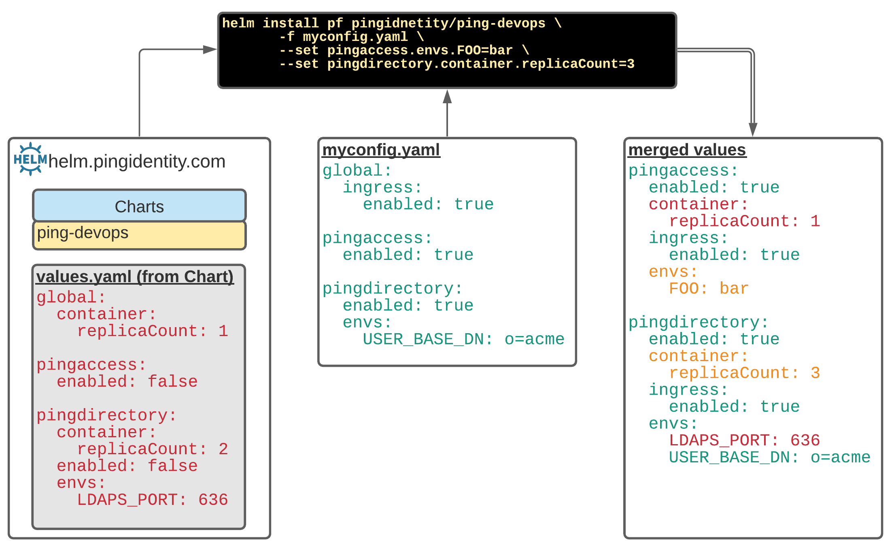

# Introduction

The charts make heavy use of `Values` yaml files to pass configuration details
to the Helm Charts.  As defined by [Helm Values Files](https://helm.sh/docs/chart_template_guide/values_files/), values are provided to the chart using the following
mechanisms:

* `values.yaml` file in the chart
* Value files passed to Helm during install/upgrade with the `-f` flag
* Individual parameters pass with the `--set` flag

The list above is in order of specificity: `values.yaml` in the chart can be overridden
with `-f` supplied files, which can in turn be overridden with the `--set` parameter.

The example below shows how values from the chart, user supplied `myconfig.yaml` and `--set` parameters are merged with each other to form a merged values.



## Chart Values

To see the values supplied by the chart, simply use the `helm show values` command to
print them.  This provides both the data as well as context sensitive comments to each
section.

```shell
helm show values pingidentity/ping-devops
############################################################
# Ping Identity DevOps values.yaml
############################################################
# ...
```

You can also see all the available values via this [values.yaml link](https://github.com/pingidentity/helm-charts/blob/master/charts/ping-devops/values.yaml)

The default values are broken up into 2 major sections:

* global - Represents the base set of values that will be provided to each product
section unless it's overridden in that section.
* product - For every image/product, the values will merged with the global settings,
and take precedence.

!!! warning
    Values can only be modified when merged.  They cannot be deleted.  Also, if a value is
    set to the boolean true, and merged with a boolean of false, it will always be true.

## global Section

The `global:` section of the values contains configuration that is available to each
products section.  If a value is set in globals, that will be available to every product.
This is very powerful, as you can turn on the ingress for every product by simply setting:

```yaml
global:
  ingress:
    enabled: true
```

This would in essence set `ingress.enabled=true` for every product:

```yaml
pingaccess:
  ingress:
    enabled: true

pingdirectory:
  ingress:
    enable: true
```
and so on.

It is much easier to set something in the `global:` section, rather than repeat it for each
product. To enable the ingress for only a few specific products, leave the default of
`global.ingress.enabled=false` and set that value for those product sections.

## Product Sections

Just like the `global:` values, each product can have the same values as well as many
more that are specific to that product/image.  In the following example,
persistent volume configuration is provided for PingDirectory:

```yaml
pingdirectory:
  persistentvolume:
    enabled: true
    volumes:
      - name: out-dir
        mountPath: /opt/out
        storage: 8Gi
        storageClassName:
```
